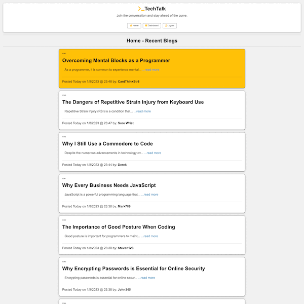

# TechTalk

# ECOM-BACK-END

## Description
Welcome to TechTalk! This is a place where tech enthusiasts can come together to share their ideas and knowledge. Whether you're looking to read about the latest tech trends or write about your own experiences and insights, our platform is here to support you.

After signing up and creating an account, you can start posting your own tech-related blogs. You can also browse and comment on the blogs of other users. And if you ever want to update or revise your own posts, you have the ability to edit them at any time.

We hope you find this platform helpful and enjoyable as you explore the world of technology. Thank you for joining us!

## Table of Contents
* [Installation](#installation)
* [Links](#Links)
* [Usage](#usage)
* [License](#license)
* [Contribute](#contribute)
* [Report Bugs](#bugreport)
* [Questions](#questions)

## Installation
No Installation requirements.


## Usage
Navigate to the following URL in your browser. 
```h
https://powerful-stream-84174.herokuapp.com/
```
New users will need to Sign Up. Click the Login/Signup button to be redirected to the signup form and enter your desired credentials then click submit.

Existing users can login via the Login/Signup button. Enter your existing credentials to log in. 

Application Screenshot:

[](https://powerful-stream-84174.herokuapp.com/)

## License 
   

  [Read more about MIT License here.](https://opensource.org/licenses/MIT)
  
  
## Contribute
N/A

## BugReport
- [E-mail Bug Report](mailto:smccombe93@gmail.com)

## Questions
Contact Links:
- [Github Profile](https://github.com/STEVEN-MCCOMBE)
- [E-mail Me](mailto:smccombe93@gmail.com)


